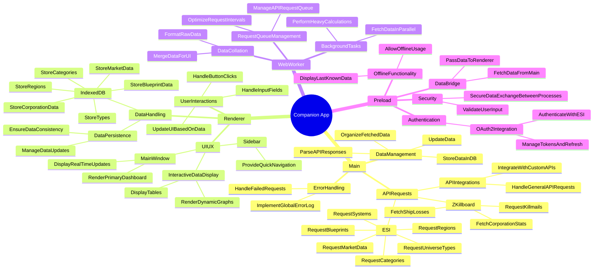

# eve-companion/

```txtnpx swagger-typescript-api \
  -p ./esi.json \
  -o ./src/api/esi \
  -n index.ts \
  --axios \
  --modular \
  --union-enums

root/
├── docs/               # GENERATED Documentation
├── img/                # Images and assets
│   ├── concept-art/
│   ├── icons/
│   ├── renders/
│   ├── stl/
│   ├── svg/
│   ├── types/
│   └── README.md
├── public/
│   └── esi-client.js
├── src/
│   ├── js/
│   │   ├── classes/
│   │   │   ├── *!* All App class exports
│   │   │   └── README.md
│   │   └── README.md
│   ├── api/
│   │   └── esi/        # GENERATED Swagger API client
│   │       ├── apis/
│   │       ├── models/
│   │       └── index.ts
│   ├── main/           # Electron main process work area
│   └── renderer/       # Electron Renderer work area
├── style-guide/        # Design docs, style references
├── package.json
├── esi.json            # (optional) local Swagger spec
```



### Object Model

```txt
Universe
├── Inventory
│   ├── Dogma
│   │   ├── DogmaAttribute
│   │   └── DogmaEffect
│   └── InventoryCategory
│       └── InventoryGroup
│           └── InventoryType
└── NewEden (map)
    └── Region
        └── Constellation
            └── System
                ├── Star
                ├── Stargate
                ├── Station
                └── Planet
                    ├── Moon
                    └── Belt
```

## Other Files
1. [GenerateReadmes.js](./GenerateReadmes.js)
2. [jsdoc.json](./jsdoc.json)
3. [package-lock.json](./package-lock.json)
4. [package.json](./package.json)

## Subfolders
- [docs/](./docs/README.md)
- [img/](./img/README.md)
- [src/](./src/README.md)
- [style-guide/](./style-guide/README.md)
